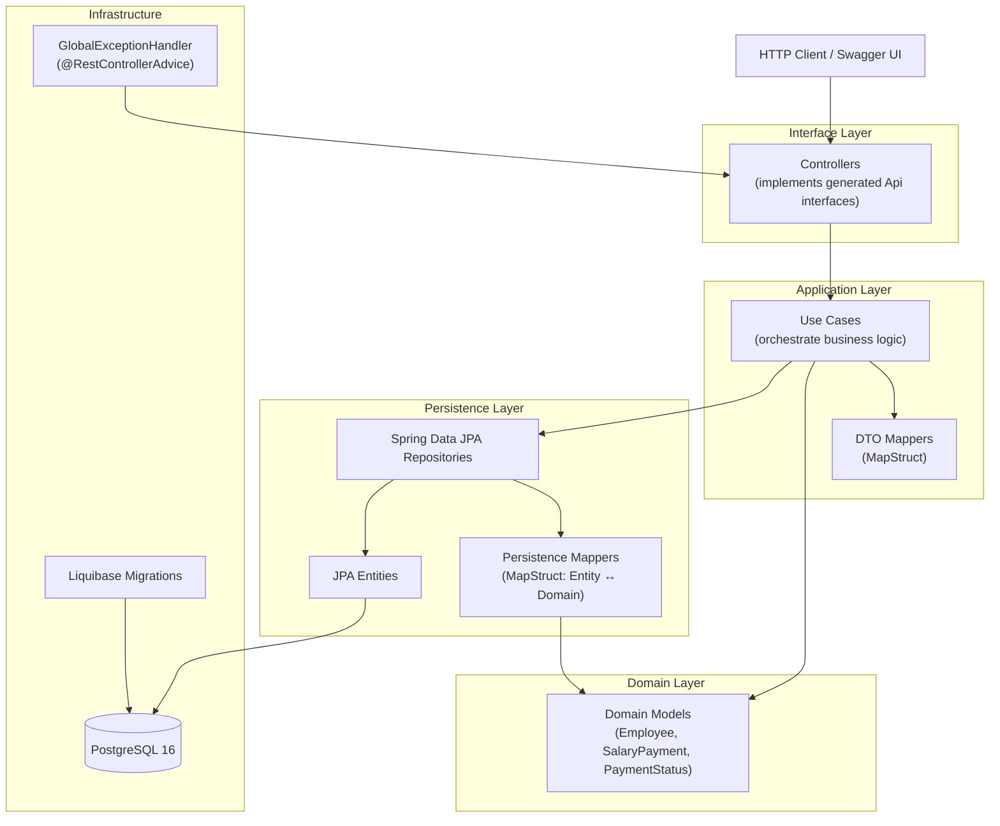

# Employee Salary Validation Platform

A RESTful microservice for managing employee salary records and payment confirmations, built using a strict **Contract-First** approach with OpenAPI 3.0. The platform supports full CRUD operations on employees, single and bulk salary payment creation, a 3-state confirmation workflow (FULLY_RECEIVED, PARTIALLY_RECEIVED, NOT_RECEIVED), and dashboard statistics aggregation.

This implementation adheres to **SRS v1.1**, covering all specified business rules, edge cases (EC-001 through EC-007), and error codes.

## Architecture

The application follows a strict layered architecture with unidirectional dependencies:



## Tech Stack

| Technology        | Purpose                              |
|-------------------|--------------------------------------|
| Java 21           | Language runtime                     |
| Spring Boot 3.4.1 | Application framework                |
| Spring Data JPA   | Database access / ORM               |
| PostgreSQL 16     | Production database                  |
| Liquibase         | Database schema versioning (XML format) |
| MapStruct 1.6.3   | Object mapping (Domain ↔ DTO / Entity) |
| OpenAPI Generator 7.8.0 | Code generation from OpenAPI spec |
| REST Assured      | REST API integration testing         |
| Testcontainers    | PostgreSQL container for tests       |
| H2                | In-memory database (test profile)    |
| SpringDoc OpenAPI | Swagger UI / OpenAPI docs            |

## Prerequisites

- **Java 21** (JDK)
- **Docker** and **Docker Compose** (required for local PostgreSQL and Testcontainers integration tests)

## Contract-First Workflow

The OpenAPI specification at `src/main/resources/api/salary-validation.yaml` is the **single source of truth** for the API contract. All controller interfaces and request/response DTOs are auto-generated from this file.

If you modify the YAML spec, regenerate the Java interfaces and models before compiling:

```bash
./gradlew openApiGenerate
```

This task runs automatically before `compileJava` via a Gradle task dependency.

## How to Run

1. Start the PostgreSQL database:
   ```bash
   docker-compose up -d
   ```

2. Generate code from the OpenAPI spec:
   ```bash
   ./gradlew openApiGenerate
   ```

3. Start the application:
   ```bash
   ./gradlew bootRun
   ```

4. Access the interactive API documentation:
   ```
   http://localhost:8080/swagger-ui.html
   ```

## Seed Data

On startup, `DataInitializer` creates the following records to facilitate testing:

| Matricule | Name           | Active | Salary Payment                                 |
|-----------|----------------|--------|------------------------------------------------|
| EMP-001   | John Doe       | Yes    | PENDING (expected: 150,000)                    |
| EMP-002   | Jane Smith     | Yes    | FULLY_RECEIVED (expected: 180,000, received: 180,000) |
| EMP-003   | Bob Johnson    | Yes    | PARTIALLY_RECEIVED (expected: 120,000, received: 80,000) |
| EMP-004   | Alice Williams | Yes    | **No payment** (edge case EC-001)              |
| EMP-005   | Charlie Brown  | **No** | **No payment** (inactive, edge case EC-002)    |

All payments are created for the **current month/year** at startup.

## How to Test

Run the full test suite:

```bash
./gradlew test
```

Testcontainers automatically:
1. Spins up a `postgres:16-alpine` container
2. Applies Liquibase migrations against it
3. Executes all integration tests (REST Assured) against the real PostgreSQL database
4. Tears down the container on completion

No manual database setup is required for testing.

### Test Coverage

| Test Class                               | What It Verifies                                                                   |
|------------------------------------------|------------------------------------------------------------------------------------|
| `EmployeeControllerIntegrationTest`      | CRUD, pagination, matricule search, soft delete, EC codes                          |
| `SalaryPaymentControllerIntegrationTest` | Single/bulk create, duplicate detection, inactive employee, transactional rollback |
| `SalaryConfirmationIntegrationTest`      | 3-state confirmation workflow, partial amount validation, double-confirm rejection |
| `DashboardControllerIntegrationTest`     | Aggregate statistics: employee counts, confirmation breakdown, amounts             |

## SRS Alignment

This implementation strictly follows **SRS v1.1**, including:

- **Business Rules:** BR-001 through BR-002 (employee lifecycle), BR-003 through BR-011 (salary payment lifecycle, bulk transactional rollback)
- **Edge Cases:**
  - EC-001: Employee with no current payment (EMP-004)
  - EC-002: Inactive employee search (EMP-005) → 403 EMPLOYEE_INACTIVE
  - EC-003: Non-existent matricule → 404 EMPLOYEE_NOT_FOUND
  - EC-004: Duplicate matricule → 409 DUPLICATE_MATRICULE
  - EC-005: Invalid partial amount (≥ expected) → 400 INVALID_AMOUNT
  - EC-006: Missing received amount for partial → 400 MISSING_RECEIVED_AMOUNT
  - EC-007: Double confirmation → 409 ALREADY_CONFIRMED
- **Error Handling:** All error responses follow a uniform `ErrorResponse` schema with `errorCode`, `message`, `status`, `timestamp`, and `path` fields
- **Validation:** Bean Validation (`@Valid`) on all request bodies, database-level CHECK constraints on `expected_amount > 0`, `pay_month` (1-12), `pay_year` (>2020)

---

The Employee Salary Validation Platform implementation is now complete.
